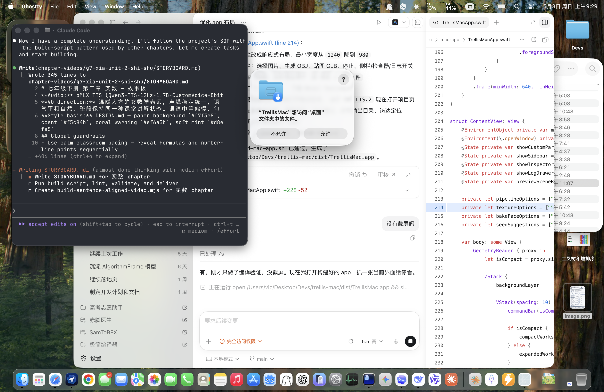

# TRELLIS.2 for Apple Silicon

[English](README.md) | 简体中文

这是一个把 [TRELLIS.2](https://github.com/microsoft/TRELLIS) 迁移到 Apple Silicon 的项目，可以在 Mac 上原生运行单图生成 3D 模型，无需 NVIDIA GPU。

项目基于 PyTorch MPS，把原本依赖 CUDA 的核心链路适配到了 Apple Silicon，同时保留命令行工作流，并提供一个可打包为 `DMG` 的 macOS 桌面应用外壳。

## 效果

在 M4 Pro（24GB）上，项目可以从单张图片生成 **40 万+ 顶点、带 PBR 贴图的 3D 网格**。冷启动完整流程大约 **5 分钟 13 秒**，其中约 3 分 20 秒用于生成和烘焙，其余时间主要是首次加载模型权重。

输出结果为带 base-color、metallic、roughness 贴图的 `GLB`，可直接导入常见 3D 工具或引擎中使用。

### 示例

**输入图片** -> **生成的 3D 网格**（约 40 万顶点、80 万三角面，带 Metal 烘焙 PBR 贴图）：

<p>


</p>

## 环境要求

- Apple Silicon Mac（M1 及以上）
- macOS
- Python 3.11+
- 建议 24GB 及以上统一内存
- 首次运行需要预留约 15GB 磁盘空间用于模型权重下载

## 快速开始

```bash
# 克隆仓库
git clone https://github.com/caicaivic0322/pico3D.git
cd pico3D

# （推荐）下载 Xcode Metal Toolchain
# 这样 setup 可以构建 Metal 加速的贴图烘焙链路
xcodebuild -downloadComponent MetalToolchain

# 登录 Hugging Face（下载 gated 权重时需要）
hf auth login

# 申请以下模型访问权限（通常很快会通过）
#   https://huggingface.co/facebook/dinov3-vitl16-pretrain-lvd1689m
#   https://huggingface.co/briaai/RMBG-2.0

# 运行初始化脚本
# 会创建 venv、安装依赖、克隆并打补丁 TRELLIS.2、
# 并在可用时构建 Metal 后端
bash setup.sh

# 激活环境
source .venv/bin/activate

# 从图片生成 3D 模型
python generate.py path/to/image.png
```

如果你想跳过 Metal 构建：

```bash
SKIP_METAL=1 bash setup.sh
```

`setup.sh` 现在会先把 Git 依赖预克隆到 `deps/`，尽量把网络下载集中到前面。如果本地状态混乱或不确定，可以直接删除 `deps/` 后重新运行：

```bash
rm -rf deps
bash setup.sh
```

默认输出会写到当前目录，也可以通过 `--output` 指定输出前缀。

对于交互式使用，推荐两阶段工作流：先用 `--stage geometry` 导出 `OBJ`、快速几何 `GLB` 和 `<output>.trellis_state.pt`，检查几何没问题后，再用 `--stage texture` 基于中间状态继续生成 `<output>_baked.glb`，避免重复跑整套 TRELLIS 推理。

## 桌面应用

仓库内包含一个基于 SwiftUI 的轻量级 macOS 桌面壳：

```bash
bash build-mac-app.sh
open dist/TrellisMac.app
```

如果要生成可分发的 `DMG`：

```bash
bash build-mac-app.sh
bash scripts/package-dmg.sh
bash scripts/verify-release.sh
```

`DMG` 中只包含 `TrellisMac.app`，不会把 Python 环境、模型权重或生成结果打进去。应用内随包携带的后端源码，会在构建时通过 `scripts/stage-backend-resources.sh` 统一整理；生成目录 `mac-app/Resources/Backend/` 不会纳入 git。

首次启动时，应用会把这份后端安装到 `~/Library/Application Support/TrellisMac/Backend`，因此终端用户不需要先手动克隆仓库再体验 `DMG`。首次使用流程大致如下：

1. 打开 `TrellisMac.app`
2. 按引导安装托管 Backend、运行 `setup.sh`、申请 Hugging Face 模型访问并登录
3. 等待应用管理的后端下载 Python 依赖、克隆 `TRELLIS.2` 并应用 Apple Silicon 补丁
4. 选择输入图片并开始生成

如果你是从源码开发而不是直接使用 `DMG`，应用也支持指向一个本地仓库目录。

当前本地构建出来的 `DMG` 默认采用 ad hoc 签名，首次打开时可能会触发 macOS Gatekeeper 警告。若要面向公众发布可直接双击安装的版本，请参考 `docs/RELEASE.md` 中的 Developer ID 签名与 notarization 流程。



## 使用方式

```bash
# 基础用法
python generate.py photo.png

# 两阶段工作流：先生成几何，再补贴图
python generate.py photo.png --stage geometry --output my_model
python generate.py --stage texture --state my_model.trellis_state.pt --output my_model --texture-size 512

# 指定随机种子和输出名
python generate.py photo.png --seed 123 --output my_model --pipeline-type 512

# 检查当前环境会使用 Metal 还是 KDTree 烘焙后端
python generate.py --check-backends

# 查看全部参数
python generate.py --help
```

| 参数 | 默认值 | 说明 |
|---|---|---|
| `--seed` | `42` | 随机种子 |
| `--output` | `output_3d` | 输出文件名前缀 |
| `--pipeline-type` | `512` | 管线分辨率：`512`、`1024`、`1024_cascade` |
| `--texture-size` | `1024` | PBR 贴图分辨率：`512`、`1024`、`2048` |
| `--no-texture` | 无 | 跳过贴图烘焙，只导出几何 |
| `--stage` | `full` | `full`、`geometry`、`texture` 三种阶段 |
| `--state` | `<output>.trellis_state.pt` | `--stage texture` 使用的中间状态文件 |
| `--bake-faces` | `100000` | 仅用于 GLB 贴图烘焙的近似面数 |
| `--simplify-target-faces` | `0` | 可选，控制几何导出时的目标面数 |
| `--check-backends` | 无 | 只打印后端诊断，不加载模型 |

## 做了哪些移植

TRELLIS.2 原始实现依赖多项 CUDA 专用库，这个项目分别替换成了可在 Apple Silicon 上运行的实现：

| 原始组件（CUDA） | 替代实现 | 作用 |
|---|---|---|
| `flex_gemm` | `mtlgemm`（Pedro Naugusto 的 Metal 版本）+ `backends/conv_none.py` 回退 | 稀疏 3D 卷积 |
| `o_voxel._C` hashmap | `backends/mesh_extract.py` | 双体素网格提取 |
| `flash_attn` | PyTorch SDPA | 稀疏 Transformer 的注意力计算 |
| `cumesh` | 解码阶段跳过 | 原本用于补洞；在大网格上会让 Metal 版本崩溃 |
| `nvdiffrast` | `mtldiffrast`（Metal）+ 纯 Python 回退 | 贴图烘焙时的可微光栅化 |

此外，代码里原来写死的 `.cuda()` 也都改成了按当前设备自动选择。

### 技术说明

**稀疏 3D 卷积**：`backends/conv_none.py` 用纯 PyTorch 实现了 submanifold sparse convolution，通过空间哈希组织激活体素，收集邻域特征，再做矩阵乘法和 scatter-add。

**网格提取**：`backends/mesh_extract.py` 用 Python 字典重写了 `flexible_dual_grid_to_mesh`，替代 CUDA hashmap 操作，负责双体素网格构建和四边形三角化。

**注意力**：在补丁后的 `full_attn.py` 中增加了 SDPA 后端，把变长序列 pad 成 batch 后走 `torch.nn.functional.scaled_dot_product_attention`，再 unpad 回去。

**贴图烘焙**：默认优先走 Pedro Naugusto 发布的 Metal 工具链，包括 `mtldiffrast`、`mtlbvh`、`mtlmesh` 和 CPU fork 的 `o_voxel`。为了避免 BVH 在超高面数输入上不稳定，烘焙前会先用 `fast_simplification` 把网格预简化到约 20 万面。若 Metal Toolchain 不可用，则退回 `backends/texture_baker.py`，走 xatlas UV 展开 + scipy cKDTree 的 CPU 烘焙路径。

## 性能

在 M4 Pro（24GB）、`pipeline_type=512`、完整 Metal 栈安装完毕、权重已缓存、`SPARSE_CONV_BACKEND=flex_gemm` 的情况下，端到端冷启动实测大约如下：

| 阶段 | 时间 |
|---|---|
| Pipeline 首次加载 | 103s |
| Sparse structure 采样（12 步） | 80s |
| Shape SLat 采样（12 步） | 22s |
| Texture SLat 采样（12 步） | 12s |
| Shape SLat decoder（VAE 前向） | ~20s |
| Tex SLat decoder（VAE 前向） | ~7s |
| `flexible_dual_grid_to_mesh` | ~8s |
| `fast_simplification`（858K -> 200K faces） | ~1s |
| Texture bake（Metal, 1024²） | ~15s |
| **总耗时（冷启动）** | **5m 13s** |
| 不含 Pipeline 加载的生成+烘焙 | 3m 20s |

高温状态下 Apple Silicon 会明显降频，同样的任务在机器持续高负载一段时间后，速度可能慢 6 到 10 倍。若你遇到异常变慢的情况，先让机器冷却再测试。

## 当前限制

- **未启用补洞**：解码期补洞依赖 `cumesh`，但当前 Metal 端在大网格上不稳定，因此跳过这一阶段，输出可能会有小孔洞
- **稀疏注意力还不是 fused**：当前 SDPA 包装能用，但仍是最大的性能瓶颈之一
- **贴图前会预简化网格**：Metal BVH 对 80 万+ 面网格不稳定，因此默认先简化到约 20 万面再烘焙
- **不支持训练**：当前只面向推理和生成

## 许可证

本仓库中的移植代码（后端、补丁、脚本等）使用 MIT License。

上游模型和权重仍分别遵循各自许可证：

- **TRELLIS.2**：MIT License
- **DINOv3**：Meta 自定义许可证，需要 gated 访问
- **RMBG-2.0**：CC BY-NC 4.0，商业使用需单独获得 BRIA 授权

## 致谢

- [TRELLIS.2](https://github.com/microsoft/TRELLIS.2) by Microsoft Research
- [DINOv3](https://github.com/facebookresearch/dinov3) by Meta
- [RMBG-2.0](https://github.com/Bria-AI/RMBG-2.0) by BRIA AI
- [@pedronaugusto](https://github.com/pedronaugusto)，提供了当前 Metal 贴图烘焙链路依赖的 `mtldiffrast`、`mtlbvh`、`mtlmesh` 和 CPU 版 `o_voxel`
